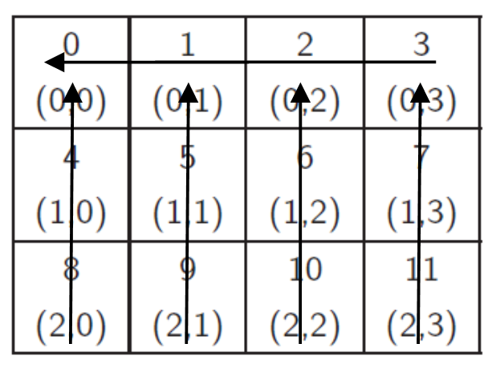

A C-MPI parallel program that based on a MxN cartesian topology of tasks, each one sums its 
elements and sends its result to its neighbor (based on the picture below), until task 0 figures
out the total sum of all elements.

Steps:
1. calculating local sum for each task
2. sending local results to the north neighbor
3. summing total each column sum by the tasks at the top row
4. sending local results of top row tasks to the west neighbor
5. task 0 calculating the total sum

Limitations:
1. the total number of the elements should be divisible by the number of tasks
2. only the MPI_Cart_sub() function used

Guide to compile and run:

1. download the .tar file from here: ftp://ftp.mcs.anl.gov/pub/mpi/old/mpich-1.2.4.tar.gz
2. sudo apt-get install gcc
3. sudo apt-get install libmpich2-dev
4. mpicc -o cart_test cart_test.c
5. mpiexec -n "number_of_tasks" ./cart_test

Tested on Lubuntu 12.04 (Precise Pangolin) on a virtual machine.